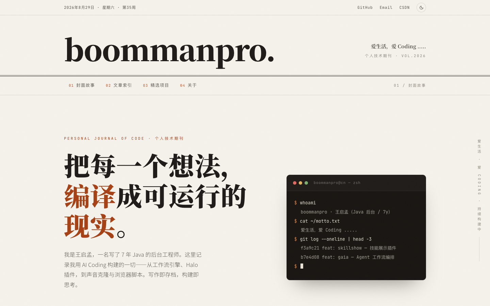
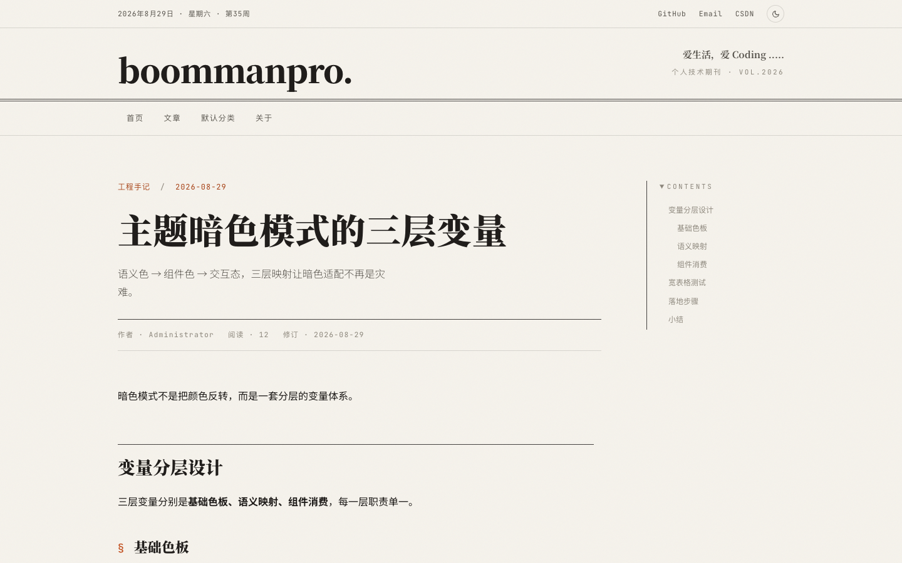
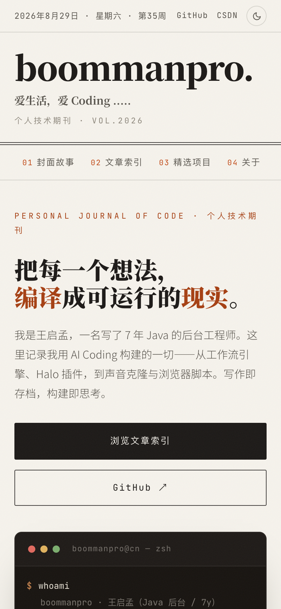
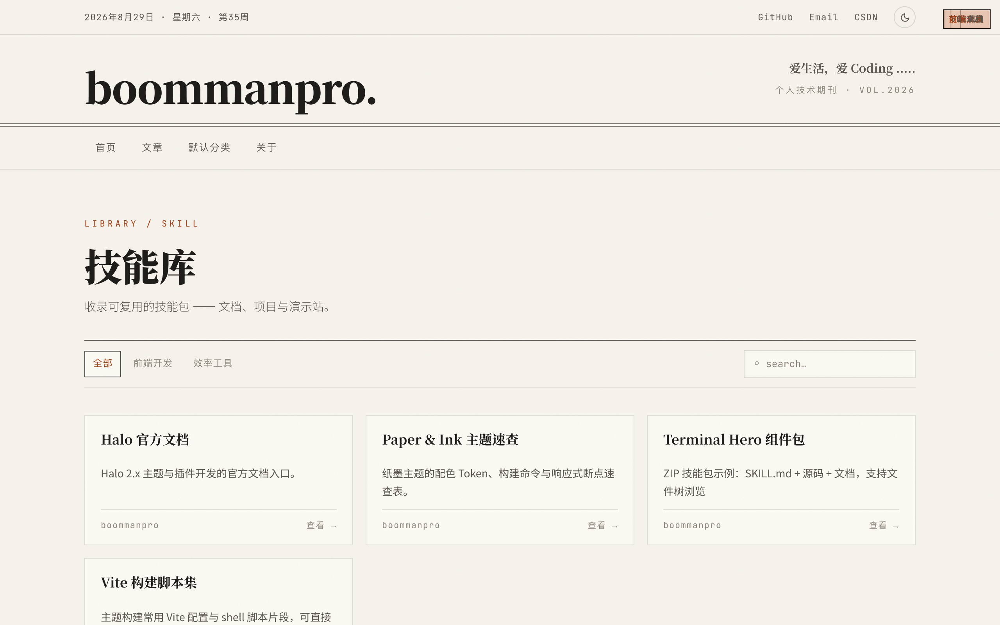
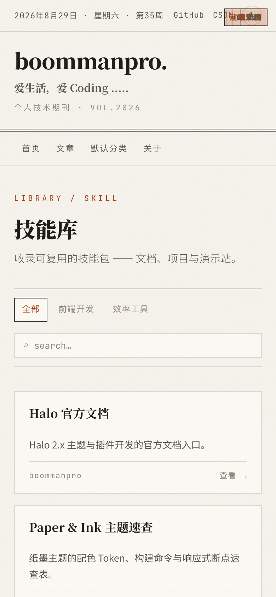

# halo-theme-boommanpro

纸与墨（Paper & Ink）风格的 [Halo](https://github.com/halo-dev/halo) 个人技术期刊主题，基于 [boommanpro.cn](https://boommanpro.cn/) 站点设计概念稿重构。



## 特性

- **纸墨美学**：衬线标题 + 无衬线正文 + 等宽代码的三元字体体系，双细线分隔、纸面底色、朱砂强调色
- **亮 / 暗色模式**：三层变量体系（基础色板 → 语义映射 → 组件消费），一键切换无闪烁
- **全站响应式**：移动端导航自适应、Hero 统计 2×2 网格、文章 TOC 折叠面板、宽表格横向滚动
- **阅读体验**：代码高亮（highlight.js 按需加载）、阅读进度条、目录滚动高亮、相关文章推荐
- **Skill 技能中心**：配套 [halo-plugin-skill-showcase](https://github.com/boommanpro/halo-plugin-skill-showcase) 插件，以自定义页面模板呈现纸墨风技能库（卡片网格 / 分类筛选 / 搜索 / 多文件浏览）
- **零图片依赖**：纯 CSS/SVG 视觉，加载快，无第三方追踪

## 截图

| 桌面文章页 | 移动端首页 |
|---|---|
|  |  |

| Skill 技能中心（桌面） | Skill 技能中心（移动端） |
|---|---|
|  |  |

## 环境要求

- Halo `>= 2.20.0`
- （可选，启用 Skill 页面）[halo-plugin-skill-showcase](https://github.com/boommanpro/halo-plugin-skill-showcase) `>= 0.1.2`

## 安装

### 方式一：Release 下载（推荐）

1. 前往 [Releases](https://github.com/boommanpro/halo-theme-boommanpro/releases) 下载最新的 `halo-theme-boommanpro-x.x.x.zip`
2. Halo Console → **外观** → **主题** → **安装** → 上传 zip 包
3. 安装完成后 **启用** 本主题

### 方式二：在线安装

Console → 外观 → 主题 → 安装，填入仓库地址：

```
https://github.com/boommanpro/halo-theme-boommanpro.git
```

## 启用 Skill 技能中心

主题内置 `skill` 自定义页面模板，配合 skill-showcase 插件使用：

1. 安装并启用 [halo-plugin-skill-showcase](https://github.com/boommanpro/halo-plugin-skill-showcase) 插件
2. 在插件管理界面添加技能分类与技能条目（支持 Markdown / ZIP 项目 / 外链三种类型）
3. Console → **页面** → **新建页面**，模板选择 **「Skill 技能中心」**，slug 建议设为 `skills`，发布
4. 访问 `https://你的域名/skills` 即可看到纸墨风技能中心

> 未安装插件时，该模板页会显示空数据提示，不影响其他页面。

## 页面模板一览

| 模板 | 路径 | 说明 |
|---|---|---|
| 首页 | `templates/index.html` | Hero + 最新文章 + 终端风格区块 |
| 文章 | `templates/post.html` | 正文 / TOC / 版权 / 上下篇 / 相关阅读 |
| 分类列表 / 分类 | `categories.html` / `category.html` | |
| 标签列表 / 标签 | `tags.html` / `tag.html` | |
| 归档 | `archives.html` | 按年月分组 |
| 独立页面 | `page.html` | |
| 友链 | `links.html` | |
| Skill 技能中心 | `skill.html` | 自定义页面模板，需配合插件 |
| 404 / 错误页 | `error/error.html` | |

## 主题配置

启用主题后，Console → 外观 → 主题 → Boommanpro → **设置**，可配置：

- 基础信息（副标题、社交链接、备案号等）
- 首页展示（统计数字、Hero 文案）
- 文章页（版权声明、相关阅读数量）
- 侧栏与页脚内容

## 开发

```bash
# 安装依赖
pnpm install

# 构建（SCSS/JS → templates/assets/dist）
pnpm run build

# 监听模式开发
pnpm run dev

# 打包 Release zip
pnpm run zip
```

构建产物 `templates/assets/dist/` 由 Vite 生成，源码位于 `src/`：

```
src/
├── css/          # SCSS 模块（变量 / 布局 / 首页 / 文章 / 打印）
├── js/           # 行为脚本（主题切换 / TOC / 高亮 / 计数 / 进度）
└── main.js       # 入口
```

本地调试可将构建产物同步到 Halo 工作目录 `themes/halo-theme-boommanpro/` 热更新。

## 发布流程

仓库配置了 GitHub Actions 自动构建：

- **CI**：push / PR 时自动安装依赖并构建校验
- **Release**：推送 `v*` 标签时自动构建 zip 并创建 Release

```bash
# 例：发布 1.0.0
# 1. 更新 theme.yaml 与 package.json 中的 version
# 2. 提交并打标签
git tag v1.0.0 && git push origin v1.0.0
# 3. Actions 自动构建并发布 Release
```

## 许可

[MIT](LICENSE) © [boommanpro](https://boommanpro.cn)
